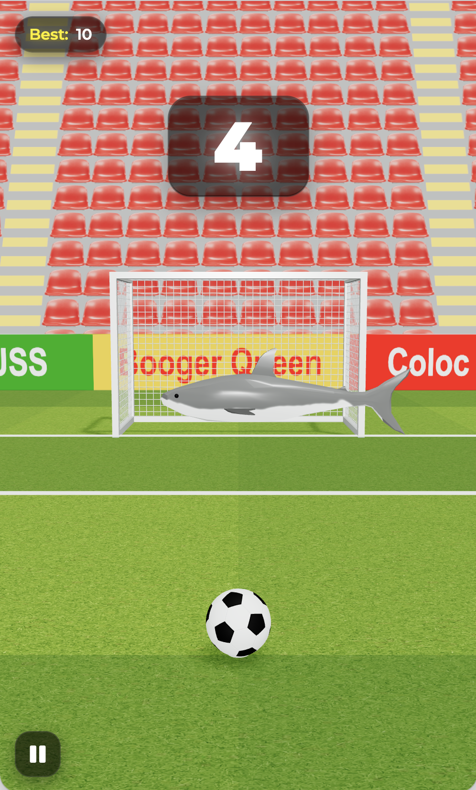

# SnapShoot

### Just Swipe Up to SnapSh⚽️⚽️t!



<a href="https://inticoy.github.io/snapshoot" target="_blank">
  
</a>

## Tech Stack

- **Frontend Framework**: Vite + React
- **Language**: TypeScript
- **Styling**: CSS
- **Integration**: Toss Game Center SDK, Toss AdMob
- **Deployment**: GitHub Pages

## Features

- 🎮 **Toss Game Center Integration**
  - Real-time leaderboard synchronization
  - Automatic score submission to Toss ranking
  - Game Center leaderboard viewer

- 📱 **Ad Integration**
  - Rewarded ads for continue gameplay
  - Seamless ad experience with Toss AdMob

## Setup

### Environment Variables

Create a `.env` file in the root directory (copy from `.env.example`):

```bash
cp .env.example .env
```

Then configure the following variables:

- `VITE_TOSS_AD_GROUP_ID`: Your Toss Ad Group ID from [Toss Apps Console](https://developers-apps-in-toss.toss.im/)

## Development

```bash
# Install dependencies
pnpm install

# Start development server
pnpm dev

# Build for production
pnpm build
```

## Toss Game Features

### Environment Detection
The game automatically detects whether it's running in:
- **Toss App**: Full feature access (leaderboard, ads, score sync)
- **Web Browser** (inticoy.github.io): Standard gameplay with localStorage

### 1. Leaderboard (Toss App Only)
- View global rankings by clicking "랭킹보기" button in Game Over modal
- Scores are automatically submitted to Toss Game Center when you score
- Web browser users will see an alert explaining this is a Toss App-only feature

### 2. Continue with Ads (Toss App Only)
- Watch rewarded ads to continue playing after a miss
- Get a second chance to improve your score
- Web browser users can continue without watching ads

### 3. Score Submission
- **Toss App**: Scores automatically sync with Toss Game Center
- **Web Browser**: Scores saved locally via localStorage

### Feature Availability Matrix

| Feature | Toss App | Web Browser |
|---------|----------|-------------|
| Play Game | ✅ | ✅ |
| Local Best Score | ✅ | ✅ |
| Toss Leaderboard | ✅ | ❌ |
| Score Sync to Toss | ✅ | ❌ |
| Rewarded Ads | ✅ | ❌ (auto-continue) |

